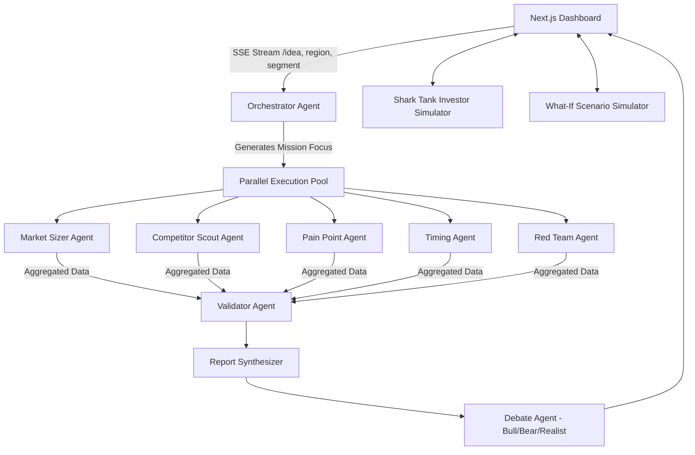

# AgentAstra (formerly StratosAI) 🚀

**A High-Performance, Multi-Agent AI System for Startup Decision Intelligence.**

AgentAstra transforms generic AI interactions into a structured, multi-model startup war room. By deploying a parallel multi-agent research pipeline, it forces rigorous reasoning, risk evaluation, and actionable output for startup consulting insights. It features a premium dashboard presenting a bull/bear debate system, market radar, and an interactive investor simulator.

---

## 🎥 Project Demo

Watch the full system in action:

<br/>
<video src="./demo.mp4" controls width="100%">
  Your browser does not support the video tag. <a href="./demo.mp4">Download Demo Video</a>
</video>
<br/>

*(If the video player does not render, please open the [`demo.mp4`](./demo.mp4) file directly in your media player).*

---

## 🏗️ System Architecture

AgentAstra is built on a high-throughput, asynchronous agentic pipeline using a multi-model routing architecture (GPT-4o, Claude Sonnet, Llama-3.3) for specialized cognitive abilities.



### 🧠 The Agent Pipeline (`backend/main.py`)
1. **Orchestrator Agent:** Receives the original idea and dynamically assigns localized parameters to the sub-agents.
2. **Specialist Agents (Parallelized):** 5 specific agents run concurrently using a `ThreadPoolExecutor` to unblock `asyncio` loops. They stream live progress to the frontend via Server-Sent Events (SSE).
3. **Validator Agent:** Cross-references the 5 independent outputs to detect contradictions or hallucinations.
4. **Report Synthesizer:** Compiles the verified outputs into a structured startup intelligence report.
5. **Debate Agent:** Takes the synthesized report and synthesizes realistic interactions between an Optimist (Bull), a Pessimist (Bear), and a Realist.

---

## 🛠️ Technology Stack

### Frontend (User Interface)
- **Framework:** [Next.js](https://nextjs.org/) (React 19)
- **Styling:** [Tailwind CSS v4](https://tailwindcss.com/)
- **Components/Icons:** [Lucide React](https://lucide.dev/), [Recharts](https://recharts.org/) for Market Radar Scatter Charts
- **Communication:** Server-Sent Events (SSE) for real-time agent activity feed.

### Backend (Multi-Agent Engine)
- **Framework:** [FastAPI](https://fastapi.tiangolo.com/) + Uvicorn
- **Streaming:** `sse-starlette` for live agent event propagation.
- **LLM Integrations:** `openai`, `anthropic`, `groq` (Dynamic Model Routing).
- **Concurrency:** `asyncio` combined with `ThreadPoolExecutor` for non-blocking multi-agent inference.

---

## 📂 Directory Structure

```text
/
├── backend/
│   ├── agents/                   # Individual LLM Agent implementations
│   │   ├── orchestrator_agent.py
│   │   ├── market_sizer_agent.py
│   │   ├── ...
│   │   └── shark_tank_agent.py   # Investor Simulation
│   ├── utils/                    # LLM multi-model routing (llm.py)
│   ├── main.py                   # FastAPI Application & SSE endpoints
│   └── requirements.txt          # Python environment dependencies (Duplicate)
├── frontend/
│   ├── package.json              # Next.js dependencies
│   ├── src/                      # React UI & Dashboard components
│   └── ...
├── backup/                       # Archival code/configurations
├── stratosai/                    # Legacy or alternative frontends
├── .env                          # API Keys (OpenAI, Anthropic, Groq)
├── requirements.txt              # Primary Python dependencies
└── demo.mp4                      # Full system demonstration video
```

---

## 🚀 Getting Started

### Prerequisites
- Node.js (v20+)
- Python 3.10+
- An `.env` file at the root containing your API Keys:
  ```env
  OPENAI_API_KEY=your_key
  ANTHROPIC_API_KEY=your_key
  GROQ_API_KEY=your_key
  ```

### 1. Run the Backend
```bash
cd backend
python -m venv venv
source venv/bin/activate  # Or `venv\Scripts\activate` on Windows
pip install -r ../requirements.txt
uvicorn main:app --reload --port 8000
```

### 2. Run the Frontend
```bash
cd frontend
npm install
npm run dev
```

The application will be accessible at `http://localhost:3000`. Watch the live agent feed as the war room generates your intelligence brief!
